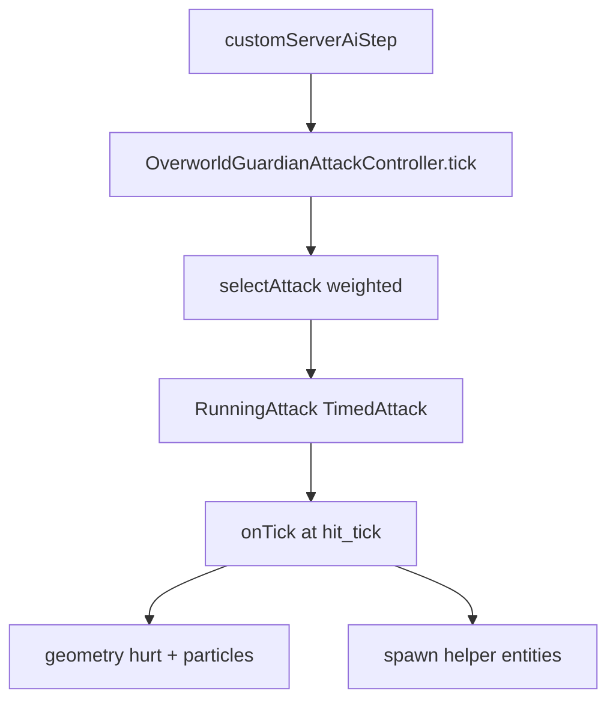

# Технический план: Overworld Guardian — атаки, AI, модели

## Ограничения (обязательно)

- **Не трогать** Nether-босса, квесты, алтари, dimension triggers, лут-таблицы (если не нужны для тестовых предметов), общий рефакторинг мода.
- **Трогать только:** `[OverworldGuardianEntity.java](common/src/main/java/me/guardian/entity/OverworldGuardianEntity.java)`, `[OverworldGuardianAttackController.java](common/src/main/java/me/guardian/entity/OverworldGuardianAttackController.java)`, сущности/блоки атак, клиентские рендереры, `[OverworldGuardianAttackConfig.java](common/src/main/java/me/guardian/config/OverworldGuardianAttackConfig.java)`, `[GuardianCommand.java](server/src/main/java/me/guardian/server/GuardianCommand.java)` (tab-complete ID), минимальные fallback-ассеты в `client/src/main/resources`.

## Текущее состояние


| #   | ID (предлагаемый) | Статус   | Где код                                                                                  |
| --- | ----------------- | -------- | ---------------------------------------------------------------------------------------- |
| 1   | `right_hand_wave` | ~90%     | `ArmWaveAttack`                                                                          |
| 2   | `left_hand_wave`  | ~90%     | `ArmWaveAttack`                                                                          |
| 3   | `two_hand_wave`   | частично | `DoubleHandWaveAttack` + `CeilingFallingBlockEntity`                                     |
| 4   | `hands_slam_line` | ~70%     | `HandsSlamLineAttack`                                                                    |
| 5   | `stomp_players`   | ~60%     | `StompPlayersAttack`                                                                     |
| 6   | `charge_ram`      | **нет**  | —                                                                                        |
| 7   | `ground_vines`    | **нет**  | —                                                                                        |
| 8   | (часть #3)        | частично | 50% только P1; P2+ всегда 2 блока — **не по спеке**                                      |
| 9   | `statue_revival`  | ~50%     | `StatueRevivalAttack` + `TempleStatueEntity`                                             |
| 10  | `vine_pull`       | **нет**  | референс: `NetherGuardianAttackController.WhipGrabAttack`                                |
| 11  | `bomb_traps`      | ~80%     | `BombTrapsAttack` + `BombTrapEntity`                                                     |
| 12  | `arena_walls`     | **нет**  | не путать с `closeGates()`                                                               |
| 13  | `leap_attack`     | **нет**  | —                                                                                        |
| 14  | `healing_shield`  | ~40%     | `HealingShieldAttack` + `HealingShieldEntity`                                            |
| 15  | gates             | ~40%     | `OverworldGuardianEntity.closeGates()` — **закрываются на P3 step 3**, не при старте боя |


Архитектура атак (не менять принцип):




---

## Стратегия моделей и визуала

**Правило:** у каждой сущности атаки — **свой** клиентский рендер и fallback-модель в JAR мода; финальные GeckoLib/текстуры — в resource pack ([docs/ASSETS.md](docs/ASSETS.md)).


| Сущность                    | Fallback сейчас                          | Что сделать в моде (до resource pack)                                                                                                                                                           |
| --------------------------- | ---------------------------------------- | ----------------------------------------------------------------------------------------------------------------------------------------------------------------------------------------------- |
| Босс                        | `boss_fallback`                          | без изменений                                                                                                                                                                                   |
| `BombTrapEntity`            | `BombTrapRenderer` → `TEMPLE_BOMB` block | оставить block-модель; улучшить частицы/масштаб                                                                                                                                                 |
| `TempleStatueEntity`        | `HuskRenderer`                           | `GeoEntityRenderer` + `geckolib/models/entity/temple_statue_fallback.geo.json` + текстура `[temple_statue.png](client/src/main/resources/assets/guardian_mod/textures/block/temple_statue.png)` |
| `HealingShieldEntity`       | `InvisibleRenderer`                      | `Display.ItemDisplay` или Geo-сфера ~2.5 блока; **обязателен hitbox**                                                                                                                           |
| `CeilingFallingBlockEntity` | vanilla `FallingBlockRenderer`           | ок                                                                                                                                                                                              |
| Новые: стена, лиана         | —                                        | `BlockDisplay` / `ItemDisplay` с `temple_gate.png` / vine item texture в JAR                                                                                                                    |
| Врата                       | `TEMPLE_GATE` block                      | проверить `blockstates`, `models/block`, `[temple_gate.png](client/src/main/resources/assets/guardian_mod/textures/block/temple_gate.png)`                                                      |


**Не класть** `boss_overworld` и финальные анимации в `client/src/main/resources` — только `*_fallback`.

Для Gemini: при добавлении Geo — копировать паттерн `[GuardianBossModel](client/src/main/java/me/guardian/client/entity/GuardianBossModel.java)` + `[GuardianBossRenderer](client/src/main/java/me/guardian/client/entity/GuardianBossRenderer.java)`.

---

## Фаза A — Исправить существующие 8 атак (приоритет 1)

### A1–A2: Удары руками (`right_hand_wave`, `left_hand_wave`)

**Спека:** ближний 10/9 только **перед** боссом и слегка справа/слева; волна 5 в радиусе ~5.5.

**Баг:** ближний урон по `distance(handPos) <= 1.5` без сектора «перед боссом».

**Правка** в `ArmWaveAttack.onTick` (hit_tick):

1. Зафиксировать `Vec3 look = safeHorizontalLook()` **один раз** в `start()`.
2. Ближний урон только если:
  - `look.dot(toTarget.normalize()) >= 0.5` (перед),
  - `look.cross(toTarget).y` знак совпадает с рукой (MAIN → справа, OFF → слева) **или** `distance to handPos <= 1.5`,
  - `horizontalDistance(center, target) <= 1.5` для «у руки».
3. Иначе — только `waveDamage` если `dist <= 5.5`.
4. QA: игрок за спиной не получает 10/9; спереди справа/слева — да.

### A3: Двуручный удар (`two_hand_wave`)

**Спека:** ближний сектор 4 блока, **14** урона; волна 5 блоков, **7** урона; не стакать — **max** из двух.

**Баг:** один `directionalImpact(7.5, 12*phase)`; нет отдельной волны и cap.

**Правка:**

```java
// hit_tick
applyMeleeCone(level, radius=4.0, damage=14f*phase, minDot=0.35);
applyRadialWave(level, radius=5.0, damage=7f*phase, knockback=..., onlyIfNotMeleeHit=true);
// dedup: Map<UUID, Float> maxDamage per tick
```

- Увеличить knockback: ближний `1.2`, волна `0.85`, Y `0.35–0.5`.
- **Падающий блок (#8):** всегда `nextFloat() < 0.5F` (убрать ветку P2+ «всегда 2 блока»); при успехе — один блок над целью/случайным смещением; `findCeiling` от `target.getY()+1` вверх до 30; `CeilingFallingBlockEntity` не ломает реальный потолок (уже так — проверить discard on land).

### A4: Удар по линии (`hands_slam_line`)

**Баги (CheckAttacks):** тайминги, направление.

**Правка:**

1. В `start()` сохранить `final Vec3 slamDir = safeHorizontalLook()` и `lineEnd = start.add(slamDir.scale(14))` — **не пересчитывать** в `damageLine`.
2. В `damageLine` добавить `slamDir.dot(toTarget.normalize()) >= 0.25` (только впереди).
3. Урон по спеке ~13–15 (сейчас 13*phase — ок); подогнать `hit_tick`/`duration` в `[OverworldGuardianAttackConfig](common/src/main/java/me/guardian/config/OverworldGuardianAttackConfig.java)` DEFAULTS (тест `/guardian boss attack hands_slam_line`).
4. Телеграф: частицы от `hit_tick-20` до `hit_tick-3` каждые 2 тика (уже есть — синхронизировать с анимацией `attack_hands_slam`).

### A5: Топот (`stomp_players`)

**Баг:** откидывание на `hit_tick`, волна кольцами на +2/+4/+6 — ощущение «не вовремя».

**Правка:**

- `hit_tick`: только урон + лёгкий dust (без KB или минимальный).
- `hit_tick+2` … `+6`: `radialBlockWaveRing` + **отдельный** `applyKnockbackRing(radius, strength)` на каждом кольце (радиус совпадает с кольцом).
- Радиус удара: 7.5 (P1) / 9.5 (P2+) — оставить; урон 10*phase.

### A9: Статуи (`statue_revival`)

**Спека:** до 3 статуй **по краям храма**, 120 HP, зомби-AI, 90% DR босса, не респавн в фазе.

**Правки:**

1. Позиции: не random 16m — читать **фиксированные оффсеты** от `boss.homeCenter()` (8 точек по сторонам света на `arenaRadius-2`), выбрать 3 случайные **свободные** (`findSurface`).
2. `TempleStatueEntity`: HP 120, `MeleeAttackGoal`, speed ~0.23; при смерти `boss.onStatueDied`.
3. Анимация босса: добавить trigger `statue_revival` в GeckoLib fallback **или** длинный windup частиц (уже есть) + звук.
4. Клиент: заменить `HuskRenderer` на Geo fallback (см. таблицу моделей).
5. Блок `TEMPLE_STATUE`: убедиться что blockstate/model виден в клиенте.

### A11: Бомбы (`bomb_traps`)

**Спека:** взрыв при **наступании**, без поломки блоков, урон < TNT (~6 ок), poison.

**Правки в `BombTrapEntity`:**

- Триггер: `living.onGround() && feet in AABB.inflate(0.35)` (сейчас только intersect — может не срабатывать).
- `explode`: убрать `HAPPY_VILLAGER`; `EXPLOSION` + `SMOKE` + `FLAME`; `level.explode` **не вызывать** (ломает блоки) — только `hurtServer` + poison 8s.
- Урон 5–6; радиус 3.
- Модель: `BombTrapRenderer` масштаб 0.8, вращение idle.

### A14: Щит (`healing_shield`)

**Баг (CheckAttacks):** «нельзя сломать» — `InvisibleRenderer` + `noPhysics` без AABB.

**Правки:**

1. `HealingShieldEntity` constructor: `setBoundingBox(new AABB(-1.25,-0.1,-1.25,1.25,3.0,1.25))`; `noPhysics = true` но **pickable**.
2. `hurtServer`: принимать урон от `Player` и от `Projectile` игрока (проверить `source.getEntity()` chain).
3. `OverworldGuardianEntity.hurtServer`: редирект на щит — ок; убедиться что `amount` не 0 после брони.
4. Лечение: 2 HP/сек (20 тиков) — ок; max 40 сек.
5. Клиент: `HealingShieldRenderer` — `BlockDisplay` кольцо или Geo `shield_fallback` с `SOUL_FIRE` particles (сервер уже шлёт).

### A8 (в составе A3): уже выше.

---

## Фаза B — Реализовать 7 отсутствующих атак (приоритет 2)

Для каждой: inner class в `OverworldGuardianAttackController`, запись в `attacks[]`, DEFAULT в `OverworldGuardianAttackConfig`, phase/stage, weight/cooldown, `/guardian boss attack <id>`.

### B6: `charge_ram` (Таран)


| Параметр   | Значение                                                                                               |
| ---------- | ------------------------------------------------------------------------------------------------------ |
| Цель       | самый **дальний** игрок в 25 блоках                                                                    |
| Windup     | 30 тиков (1.5 с) — поворот к цели, частицы                                                             |
| Dash       | 20 блоков по **зафиксированному** `Vec3 dir`, speed ~1.8/tick, `boss.noPhysics` или кастомное `move()` |
| Попадание  | 14 урона + KB по пути (AABB ширина ~2)                                                                 |
| После      | волна 3 блока шириной, урон 4–10 от центра линии (`lerp`)                                              |
| Стан босса | 200 тиков (10 с) — флаг `boss.setChargeStunned(true)`; `AttackController.tick` early return            |
| Phase      | P2, stage 2+                                                                                           |
| weight     | 2, cooldown ~400                                                                                       |


Референс движения: `[GenericBossEntity](common/src/main/java/me/guardian/entity/GenericBossEntity.java)` charge logic.

### B7: `ground_vines` (Лианы под игроками)

1. Windup 40 тиков: анимация `attack_both` + частицы земли у босса.
2. Выбрать до 3 случайных `Player` в 30 блоках.
3. За 20 тиков до удара — слабые частицы под ногами.
4. `hit_tick`: если игрок в радиусе 1.5 от точки — 12 урона + `setDeltaMovement(0, 1.1, 0)`.
5. После: `boss.setTarget(nearestPlayer(6))` + форс `right_hand_wave` **или** внутренний вызов `ArmWaveAttack` (не рекурсия RunningAttack — флаг `pendingFollowUpMelee`).

Новая сущность **не обязательна** — достаточно частиц + BlockDisplay «лиана» на 10 тиков (fallback).

### B10: `vine_pull` (Лиана-притягивание)

1. Выбрать 1 игрока (threat table / random in range 20).
2. 25 тиков телеграф — линия частиц босс → игрок (как `renderSlamLine`).
3. Притянуть: каждые 2 тика сдвиг `position` на 15% к боссу, 20–30 тиков; иммунитет к падению.
4. По завершении: **сразу** `two_hand_wave` (`forceAttack` или `pendingCombo = two_hand_wave`).
5. Phase P2 stage 3+, weight 3, cooldown 320.

Референс: `WhipGrabAttack` в Nether controller.

### B12: `arena_walls` (Стены вокруг)

**Условие:** `countPlayersWithin(5) >= 2`.

1. Новая сущность `TempleWallSegmentEntity` (HP 150, immobile, no AI).
2. Кольцо из 8–12 сегментов радиус ~4–5 вокруг `boss.position()`, высота 3 блока.
3. При уроне — только сегмент умирает.
4. Таймер исчезновения: каждые 20 тиков считать игроков внутри полигона; правила из спеки (5/20/30/40 сек).
5. Fallback render: `BlockDisplay` + `TEMPLE_GATE` texture.
6. Phase P3 stage 1+, weight 2 (низкий), cooldown 500.

### B13: `leap_attack` (Прыжок)

1. `canUse`: target within 16 blocks.
2. Windup 100 тиков (5 с) — босс `setNoAi(true)`, круг частиц, look at target.
3. Подъём: 10 блоков за 15 тиков (`setDeltaMovement(0, 0.7, 0)`).
4. Полёт к позиции цели 10–15 тиков.
5. Приземление: 19 урона + KB 1.4 в радиусе 2.5; `BlockParticle` + `GUST`.
6. Phase P3 stage 2+, weight 1, cooldown 600.
7. Анимация: `attack_hands_slam` или новый trigger `leap` в fallback JSON (loop windup + slam).

### B15: Врата храма (не атака контроллера)

**Спека:** закрыть **при начале боя**; открыть при смерти босса; wipe + cooldown 1ч — уже частично в `tickGateWipe`.

**Правки:**

1. Перенести `closeGates(level)` из `tickPhase` (P3 step 3) в `triggerSpawnEvent()` сразу после `spawnEventTriggered = true`.
2. Удалить/отключить блок `gates33Triggered` в `tickPhase` (или оставить только как fallback если gates не закрылись).
3. `closeGates`: перед установкой блоков **найти пол** — `cy = findSurface(cx,cz).getY()` вместо фиксированного `spawnCenter.Y` (частая причина «нет блоков»).
4. Проверить `TempleGateBlock.getDestroyProgress == 0` и blast resistance в `ModBlocks`.
5. `openGates` на `die()` — уже есть.

### Регистрация новых ID

Обновить массив в конструкторе `OverworldGuardianAttackController` (~15 классов), `OverworldGuardianAttackConfig.DEFAULTS`, `GuardianCommandAttackSuggestions` / tab-complete.

---

## Фаза C — Улучшение AI и поведения (после атак)

Файл: `[OverworldGuardianAttackController.tick](common/src/main/java/me/guardian/entity/OverworldGuardianAttackController.java)` + `[OverworldGuardianThreatTable](common/src/main/java/me/guardian/entity/OverworldGuardianThreatTable.java)`.


| Задача         | Действие                                                                                                     |
| -------------- | ------------------------------------------------------------------------------------------------------------ |
| Выбор атаки    | Добавить в `situationalWeight` новые id (charge при far, walls при 2+ игроках рядом, leap при low HP target) |
| Счётчик ударов | Уже есть `unansweredHits` / counter — связать с `vine_pull` и `two_hand_wave`                                |
| Движение       | Не двигаться при `runningAttack` и `chargeStunned`; P3 не отступать                                          |
| Цель           | `threatTable` — приоритет дальним для charge, ближним для melee                                              |
| Home leash     | `shouldReturnTowardHome` — не стартовать charge/leap если далеко от home                                     |
| Gate wipe      | Расширить проверку «все мертвы/вышли» — опционально 0 HP в арене 10 сек (уже 10 сек без игроков)             |


---

## Фаза D — Оптимизация

- `activeShockwaves`: cap max 48 `BlockDisplay`, TTL 8 тиков (уже `ShockwaveBlock.tick`).
- Не спавнить больше 6 `BombTrap` за каст.
- `TempleWallSegmentEntity`: batch discard при таймере.
- Избегать `getEntitiesOfClass` каждый тик в dash — раз в 2 тика или AABB cache.
- `OverworldGuardianAttackConfig.tickAutoReload` — оставить.

---

## Файлы для создания/изменения (чеклист Gemini)

**Common**

- `OverworldGuardianAttackController.java` — основная работа
- `OverworldGuardianEntity.java` — gates, charge stun, combo flags, DR statues
- `OverworldGuardianAttackConfig.java` — 7 новых DEFAULTS
- `BombTrapEntity.java`, `HealingShieldEntity.java`, `TempleStatueEntity.java`
- **NEW** `TempleWallSegmentEntity.java`, `ModEntities` register
- `CeilingFallingBlockEntity.java` — verify land discard

**Client**

- `GuardianModClient.java` — renderers
- **NEW** `TempleStatueRenderer`, `HealingShieldRenderer`, optional `TempleWallRenderer`
- **NEW** fallback geo/json under `assets/guardian_mod/geckolib/...`

**Server**

- `GuardianCommand.java` — attack ID suggestions (все 15 id)

**Docs (deliverable)**

- Создать `[docs/OVERWORLD_BOSS_TECH_PLAN.md](docs/OVERWORLD_BOSS_TECH_PLAN.md)` — копия этого плана + таблица acceptance criteria из `attackList.md`

---

## Порядок исполнения для Gemini (строго)

1. A1–A2 → A3+A8 → A4 → A5 → A14 → A11 → A9
2. B15 (gates) — можно параллельно после A1
3. B6 → B7 → B10 → B12 → B13
4. C (AI weights)
5. D (optimization)
6. Прогон QA по `CheckAttacks.md` + ручной чеклист ниже

---

## Acceptance / тест-план

Для каждой атаки: `/guardian boss attack <id>` на Overworld Guardian в арене.


| ID                                   | Критерий готовности                                   |
| ------------------------------------ | ----------------------------------------------------- |
| `right_hand_wave` / `left_hand_wave` | 10/9 спереди; 5 в волне; за спиной нет ближнего       |
| `two_hand_wave`                      | 14 в 4б, 7 в 5б, без двойного урона; KB заметный      |
| `hands_slam_line`                    | урон только на линии взгляда                          |
| `stomp_players`                      | KB на кольцах волны, не только в tick 0               |
| `charge_ram`                         | 1.5с прицел, 20б рывок, стан 10с, волна после         |
| `ground_vines`                       | 3 цели, 12 dmg + подброс, follow-up melee             |
| `vine_pull`                          | притягивание + instant `two_hand_wave`                |
| `bomb_traps`                         | шаг = взрыв, нет крушения блоков, poison              |
| `statue_revival`                     | 3 моба, DR 90%, блоки на краю                         |
| `arena_walls`                        | 2+ игрока, HP 150, таймеры 5/20/30/40                 |
| `leap_attack`                        | 5с windup, 19 dmg, KB                                 |
| `healing_shield`                     | видимый щит, 300 HP, босс не получает урон до слома   |
| gates                                | закрыты при агро; открыты при смерти; wipe + cooldown |


---

## Константы урона (сводка из attackList.md)

Использовать `phaseMultiplier()` только где указано «масштаб по фазе»; иначе фиксированные значения из спеки.


| Атака                   | Урон           |
| ----------------------- | -------------- |
| Right hand close / wave | 10 / 5         |
| Left hand close / wave  | 9 / 5          |
| Two hand close / wave   | 14 / 7         |
| Slam line               | ~13–15         |
| Stomp                   | 10 (+ wave KB) |
| Charge hit / wave       | 14 / 4–10      |
| Vines                   | 12             |
| Leap                    | 19             |
| Bomb                    | ~5–6 + poison  |


---

## Что НЕ делать в этой итерации

- Финальные модели в resource pack (только заглушки в JAR).
- Баланс Nether-босса.
- Новые предметы/дропы (если не нужны для ItemDisplay — использовать `ModBlocks` textures).

